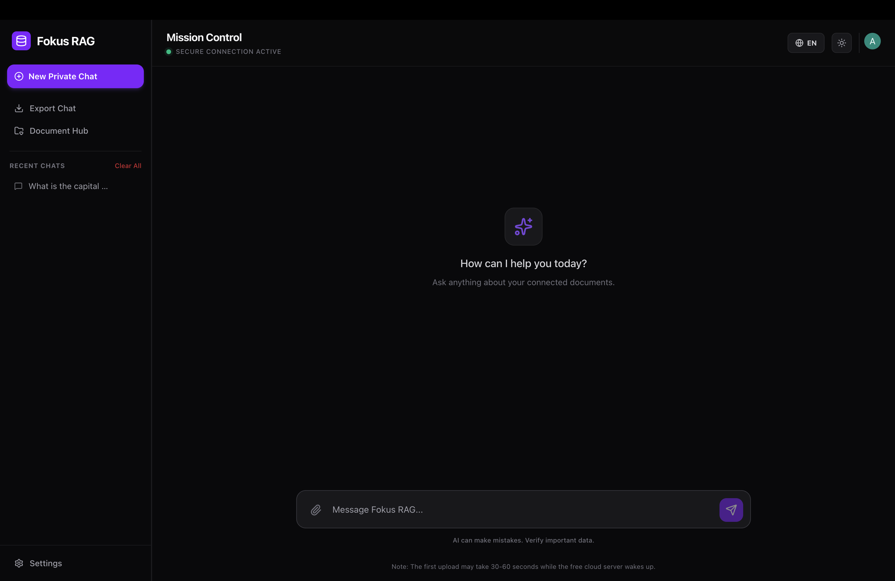
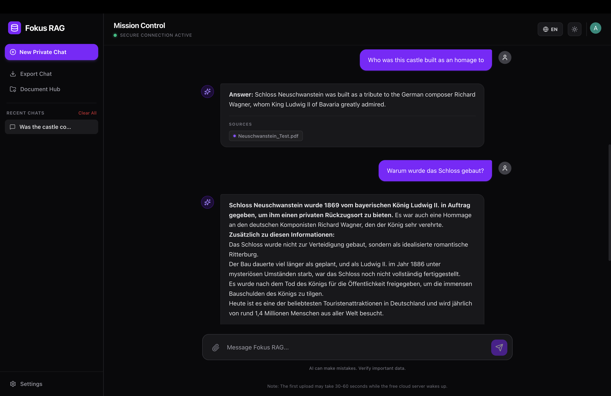
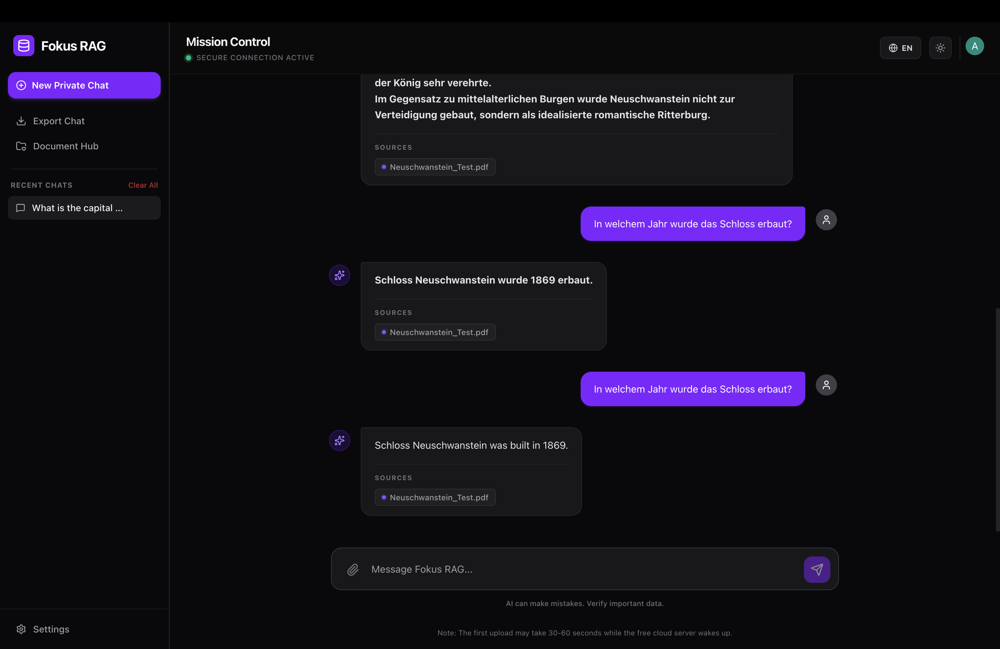

# Fokus RAG — Multilingual Document Q&A

Ask questions about your PDFs and get grounded, source-based answers.
Fokus RAG is a full-stack **Retrieval-Augmented Generation (RAG)** application:
upload documents, and the system retrieves the most relevant passages and uses a
large language model to answer — in multiple languages.

**Live demo:** https://fokus-rag.vercel.app/





---

## What it does

- **Upload PDFs** and have them automatically chunked and embedded
- **Ask questions in natural language** — answers are grounded in the document,
  not hallucinated
- **Multilingual** — works across documents and questions in different languages
- **Source-aware** — answers are built from retrieved context, reducing made-up
  responses

---

## How it works

```
PDF upload
   │
   ▼
Chunking ──► Embeddings ──► Vector store (ChromaDB)
                                   │
User question ──► Embed ──► Similarity search ──► Retrieved context
                                                        │
                                                        ▼
                                          Reranking ──► LLM (Cohere) ──► Answer
```

The pipeline handles document ingestion, embedding generation, vector similarity
search, contextual **reranking** to surface the most relevant chunks, and prompt
construction so the LLM answers only from retrieved context.

---

## Tech stack

**Backend:** Python · FastAPI · LangChain · ChromaDB (vector database) ·
Cohere Command-R
**Frontend:** React · Vite
**Deployment:** Docker · Render

---

## Key engineering decisions

- **Chunking strategy** tuned to balance retrieval precision against context size
- **Contextual reranking** after vector search to improve answer relevance
- **Grounded prompting** so the model answers from retrieved passages rather than
  its own priors — the core mechanism for reducing hallucinations
- **Async FastAPI** backend to keep uploads and queries responsive

---

## Running locally

```bash
# Backend
cd backend
pip install -r requirements.txt
uvicorn main:app --reload

# Frontend
cd frontend
npm install
npm run dev
```

Add your Cohere API key to a `.env` file:

```
COHERE_API_KEY=your_key_here
```

---

## About

Built as a self-directed project to understand RAG systems end-to-end — from
document ingestion and embeddings through retrieval, reranking, and grounded
generation. Developed alongside my M.Sc. in Computer Science (E-Government) at the
University of Koblenz.

**Author:** Aswin Pulickal Binduraj · [LinkedIn](https://linkedin.com/in/aswin-pulickal) · [GitHub](https://github.com/aswin8884)
